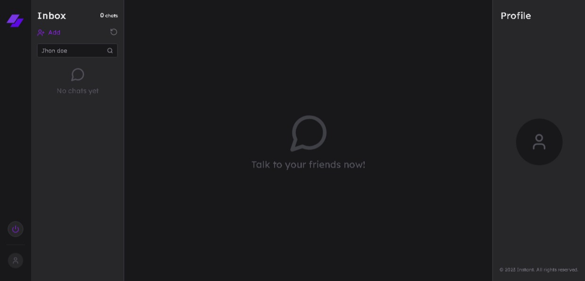

<div align="center">
  
  <h1>Chat Realtime App</h1>
</div>

## 📃 Sobre

<br />

Este é um aplicativo de chat em tempo real desenvolvido com Node.js, Socket.IO e Next.js . O objetivo principal é fornecer uma plataforma de chat interativa e em tempo real para os usuários.

## 💻 Principais Tecnologias utilizadas no projeto

Este projeto utiliza diversas tecnologias bem legais e úteis que você talvez possa gostar e utilizar em alguns projetos.

- [Node.js](https://nodejs.org/en/)
- [Socket.io](https://socket.io/)
- [Docker](https://www.docker.com)
- [PostgreSQL](https://www.postgresql.org/)
- [Prisma](https://www.prisma.io)
- [Clerk](https://clerk.com/)
- [Next.js](https://nextjs.org)

## Features Principais

- Autenticação com email e senha.

- Autenticação social.

- Criação de salas

- Chat em Tempo Real podendo enviar mensagens de texto, imagens e áudio (futuramente).

- Fixar sala

- Remover sala

## Pré-requisitos

Certifique-se de ter o Docker e o Node.js instalados na sua máquina. Para instalar o Docker, siga as instruções em  [docker.com](https://www.docker.com). Para instalar o Node.js visite [node.js](https://nodejs.org/en/)

## Como executar o projeto na sua máquina

<br />

Para executar o projeto você terá de seguir os passos listados abaixo. 

## Aviso

**Passo Importante**: Você terá de preencher às variáveis ambiente de cada projeto. para ajudá-lo haverá arquivos ".env.example" indicando quais variáveis são necessárias. preencha todas e execute os próximos passos.

Primeiro clone o repositório do projeto com o comando:

```bash
git clone git@github.com:henrique998/instant.git
```

### Back-end

Execute um dos comandos abaixo para instalar as dependências do projeto:

```bash
npm install
# OU
yarn install
```

Execute o seguinte comando para iniciar o contêiner do PostgreSQL:

```bash
docker-compose up -d
```

Execute as migrations usando o prisma:

```bash
npx prisma migrate dev
# OU
yarn prisma migrate dev
```

Em "src/server.ts", execute o seguinte comando para iniciar o servidor:

```bash
npm run dev
# OU
yarn dev
```

<br />

### Frontend

Navegue até o diretório "web" e execute:

```bash
yarn install
yarn dev
```

<br />

## Contato

Entre em contato comigo por email ou no linkedin:

- henriquemonteiro037@gmail.com
- [linkedin](https://www.linkedin.com/in/henrique-monteiro1/)